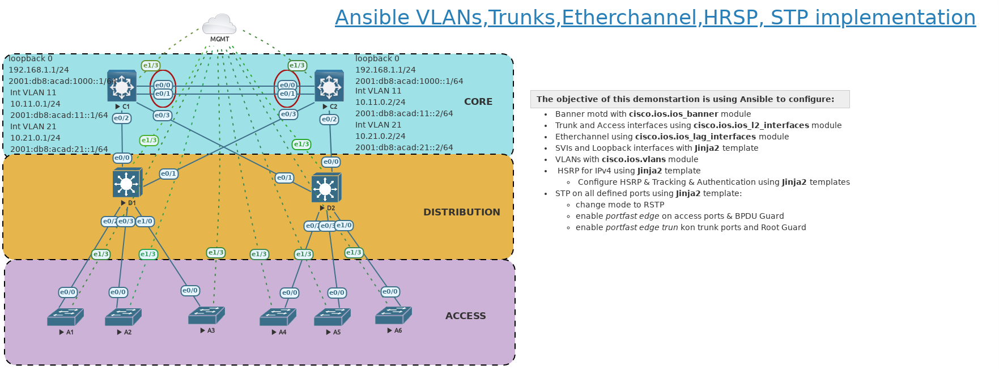

# Using Ansible to configure VLANs, Trunks, Etherchannel, STP and HSRP
***
#### Short summary
Eve-ng topology is stored in **eveng/** directory. I used eve-ng pro version. Please use Python virutal Environments.This was compiled to support ansible 2.13.5 .

***
###TOPOLOGY




#### Files structure

```
#tree -L 2
.
├── ansible.cfg
├── backups
│   ├── POST-CRQ_A1_2022-07-29T07:20:13Z.cfg
│   ├── POST-CRQ_A1_2022-07-29T07:39:45Z.cfg
│   
│   ├── PRE-CRQ_A1_2022-07-29T10:35:20Z.cfg
│   ├── PRE-CRQ_A1_2022-07-29T10:46:52Z.cfg
│   ├── PRE-CRQ_A1_2022-07-29T11:03:00Z.cfg
│   ├── PRE-CRQ_A1_2022-07-29T11:09:16Z.cfg

├── basic_config.yml
├── collections
│   ├── reqs.yml
│   ├── requirements.yml
│   └── requirements.yml_back
├── eveng
│   └── _Exports_eve-ng_export-20221028-112813.zip
├── gather_ip_addr.yml
├── group_vars
│   ├── access.yml
│   ├── core.yml
│   └── distribution.yml
├── hosts
├── host_vars
│   ├── A1.yml
│   ├── A2.yml
│   ├── A3.yml
│   ├── A4.yml
│   ├── A5.yml
│   ├── A6.yml
│   ├── C1.yml
│   ├── C2.yml
│   ├── D1.yml
│   └── D2.yml
├── hsrp_config.yml
├── hsrp_final.yml
├── README.md
├── requirements.txt
├── roles
│   ├── backup_config
│   ├── etherchanel
│   ├── hsrp
│   ├── motd_banner
│   ├── routed_interfaces
│   ├── save_config
│   ├── spanningtree
│   ├── sw_interfaces
│   ├── tracking
│   └── vlans
├── topology.png
├── tree.txt
├── venv
│   ├── bin
│   ├── include
│   ├── lib
│   ├── lib64 -> lib
│   ├── pyvenv.cfg
│   └── share
└── vrunner
    ├── bin
    ├── include
    ├── lib
    ├── lib64 -> lib
    ├── pyvenv.cfg
    └── share
```

***
#### Please use Python venv
`source venv/bin/activate`

#### How to push configuration with Ansible playbook(s). 
There are two ways to use this demonstration.

- Single command:

    `ansible-playbook hsrp_final.yml`

- dual command execution.

    Configure basic settings using *basic_config.yml* including creating interfaces, assigning IP addresses, adding VLANs and configure Access & Trunk ports.

    `ansible-playbook basic_config.yml`

    Apply HSRP and tracking settings.

    `ansible-playbook hsrp_config.yml`


For efficiency I use Ansible roles as well as Jinja2 templates.

***
#### Final config
```yml
---
- name: Get date
  hosts: localhost
  gather_facts: true
  tasks:
    - name: Config Timestamp
      ansible.builtin.set_fact:
        dtg: "{{ ansible_date_time.iso8601 }}"
      tags: gettime  

- name: Pre CRQ config backup
  hosts: all
  gather_facts: false
  tags: backup
  vars:
    pref: PRE-CRQ
  roles:
    - backup_config

- name: Configuring Basic Topology
  hosts: all
  gather_facts: false
  tags: basic
  roles:
    - motd_banner
    - vlans
    - sw_interfaces
    - role: etherchanel
      when: "portchannels is defined"
    - routed_interfaces
    - role: spanningtree
      tags: stp
    - save_config

- name: Configuring HSRP
  hosts: all
  roles:
    - hsrp
    - tracking

- name: Post CRQ config backup
  hosts: all
  tags: backup
  gather_facts: false
  vars:
    pref: POST-CRQ
  roles:
    - backup_config

...

```


#### Looping over rooted interfaces with Jinja2
```Jinja2

#jinja2: lstrip_blocks:True, trim_blocks:True

interface {{ intf.name }}

   description {{ intf.description }} 


   no switchport


   ip address {{ intf.ipv4 | ipaddr('address') }} {{ intf.ipv4 | ipaddr('netmask')}}


   ipv6 address {{ intf.ipv6 }}


   ipv6 address {{ intf.link_local}} link-local


   no cdp enable

   no shutdown


```

#### STP configuration with Jinja2 template
```Jinja2

spanning-tree mode rapid-pvst

spanning-tree vlan {{ spantree.root_primary }} root primary
 {#rootprimary#}

spanning-tree  vlan {{ spantree.root_secondary }} root secondary
 {#rootescondary#}
 {#spantree#}


interface {{ interface.name }}

  spanning-tree portfast trunk
 {# trunkmode#}

  spanning-tree portfast edge
 {#accessmode#}

  spanning-tree guard root
 {#rootguard#}

  spanning-tree portfast bpduguard
 {#bpduguard#}
{#modedefined#}


```

#### HSRP configuration with Jinja2 template

```Jinja2

  
interface {{ interface.name }}

  standby version 2
  standby {{ interface.hsrpid }} ip {{ interface.vip }}
  standby {{ interface.hsrpid }} timers msec {{ interface.hello }} msec {{ interface.dead }}
  standby {{ interface.hsrpid }} authentication {{ interface.auth }} key-string {{ interface.string }}

  standby {{ interface.hsrpid}} priority {{ interface.priority }}


  standby 10 {{ interface.preempt }}

    
  standby {{ interface.hsrpid}} track {{ interface.trackid }} decrement 30



{# Vlan in iterface name #}


```